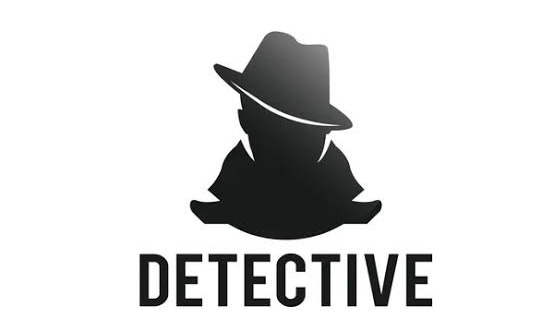

# 📦 Project Summary: Namsommut

> Generated on: 2025-12-18 22:14:17

## 🗂 โครงสร้างโปรเจกต์

```text
.
├── .บันทึก.md
├── 404.html
├── PROJECT_SUMMARY.md
├── README.md
├── about.html
├── assets
│   ├── css
│   │   ├── main.css
│   │   ├── responsive.css
│   │   └── theme.css
│   ├── fonts
│   ├── img
│   │   ├── banner.jpg
│   │   ├── favicon.ico
│   │   ├── logo.png
│   │   ├── team1.jpg
│   │   ├── team2.jpg
│   │   └── team3.jpg
│   └── js
│       ├── app.js
│       ├── config.js
│       ├── contact-handler.js
│       ├── render.js
│       └── utils.js
├── cases.html
├── components
│   ├── cta.html
│   ├── footer.html
│   ├── header.html
│   └── hero.html
├── contact.html
├── data
│   ├── cases.json
│   ├── logs.txt
│   ├── reviews.json
│   ├── services.json
│   ├── site.json
│   └── team.json
├── index.html
├── privacy.html
├── review.html
├── scripts
│   └── project-summary.sh
└── services.html

9 directories, 36 files
```

## 📄 File Scan (แสดง 60 บรรทัดแรกของทุกไฟล์)

### 📄 `.git/COMMIT_EDITMSG`

```
first commit
```

### 📄 `.git/HEAD`

```
ref: refs/heads/main
```

### 📄 `.git/MERGE_RR`

_[binary file – ไม่แสดงเนื้อหา]_

### 📄 `.git/config`

```
[core]
	repositoryformatversion = 0
	filemode = true
	bare = false
	logallrefupdates = true
[remote "origin"]
	url = https://github.com/jiggoo0/Namsommut.git
	fetch = +refs/heads/*:refs/remotes/origin/*
[branch "main"]
	remote = origin
	merge = refs/heads/main
```

### 📄 `.git/description`

```
Unnamed repository; edit this file 'description' to name the repository.
```

### 📄 `.git/hooks/applypatch-msg.sample`

```
#!/data/data/com.termux/files/usr/bin/sh
#
# An example hook script to check the commit log message taken by
# applypatch from an e-mail message.
#
# The hook should exit with non-zero status after issuing an
# appropriate message if it wants to stop the commit.  The hook is
# allowed to edit the commit message file.
#
# To enable this hook, rename this file to "applypatch-msg".

. git-sh-setup
commitmsg="$(git rev-parse --git-path hooks/commit-msg)"
test -x "$commitmsg" && exec "$commitmsg" ${1+"$@"}
:
```

### 📄 `.git/hooks/commit-msg.sample`

```
#!/data/data/com.termux/files/usr/bin/sh
#
# An example hook script to check the commit log message.
# Called by "git commit" with one argument, the name of the file
# that has the commit message.  The hook should exit with non-zero
# status after issuing an appropriate message if it wants to stop the
# commit.  The hook is allowed to edit the commit message file.
#
# To enable this hook, rename this file to "commit-msg".

# Uncomment the below to add a Signed-off-by line to the message.
# Doing this in a hook is a bad idea in general, but the prepare-commit-msg
# hook is more suited to it.
#
# SOB=$(git var GIT_AUTHOR_IDENT | sed -n 's/^\(.*>\).*$/Signed-off-by: \1/p')
# grep -qs "^$SOB" "$1" || echo "$SOB" >> "$1"

# This example catches duplicate Signed-off-by lines.

test "" = "$(grep '^Signed-off-by: ' "$1" |
	 sort | uniq -c | sed -e '/^[ 	]*1[ 	]/d')" || {
	echo >&2 Duplicate Signed-off-by lines.
	exit 1
}
```

### 📄 `.git/hooks/fsmonitor-watchman.sample`

```
#!/data/data/com.termux/files/usr/bin/perl

use strict;
use warnings;
use IPC::Open2;

# An example hook script to integrate Watchman
# (https://facebook.github.io/watchman/) with git to speed up detecting
# new and modified files.
#
# The hook is passed a version (currently 2) and last update token
# formatted as a string and outputs to stdout a new update token and
# all files that have been modified since the update token. Paths must
# be relative to the root of the working tree and separated by a single NUL.
#
# To enable this hook, rename this file to "query-watchman" and set
# 'git config core.fsmonitor .git/hooks/query-watchman'
#
my ($version, $last_update_token) = @ARGV;

# Uncomment for debugging
# print STDERR "$0 $version $last_update_token\n";

# Check the hook interface version
if ($version ne 2) {
	die "Unsupported query-fsmonitor hook version '$version'.\n" .
	    "Falling back to scanning...\n";
}

my $git_work_tree = get_working_dir();

my $retry = 1;

my $json_pkg;
eval {
	require JSON::XS;
	$json_pkg = "JSON::XS";
	1;
} or do {
	require JSON::PP;
	$json_pkg = "JSON::PP";
};

launch_watchman();

sub launch_watchman {
	my $o = watchman_query();
	if (is_work_tree_watched($o)) {
		output_result($o->{clock}, @{$o->{files}});
	}
}

sub output_result {
	my ($clockid, @files) = @_;

	# Uncomment for debugging watchman output
	# open (my $fh, ">", ".git/watchman-output.out");
	# binmode $fh, ":utf8";
	# print $fh "$clockid\n@files\n";
	# close $fh;
```

### 📄 `.git/hooks/post-update.sample`

```
#!/data/data/com.termux/files/usr/bin/sh
#
# An example hook script to prepare a packed repository for use over
# dumb transports.
#
# To enable this hook, rename this file to "post-update".

exec git update-server-info
```

### 📄 `.git/hooks/pre-applypatch.sample`

```
#!/data/data/com.termux/files/usr/bin/sh
#
# An example hook script to verify what is about to be committed
# by applypatch from an e-mail message.
#
# The hook should exit with non-zero status after issuing an
# appropriate message if it wants to stop the commit.
#
# To enable this hook, rename this file to "pre-applypatch".

. git-sh-setup
precommit="$(git rev-parse --git-path hooks/pre-commit)"
test -x "$precommit" && exec "$precommit" ${1+"$@"}
:
```

### 📄 `.git/hooks/pre-commit.sample`

```
#!/data/data/com.termux/files/usr/bin/sh
#
# An example hook script to verify what is about to be committed.
# Called by "git commit" with no arguments.  The hook should
# exit with non-zero status after issuing an appropriate message if
# it wants to stop the commit.
#
# To enable this hook, rename this file to "pre-commit".

if git rev-parse --verify HEAD >/dev/null 2>&1
then
	against=HEAD
else
	# Initial commit: diff against an empty tree object
	against=$(git hash-object -t tree /dev/null)
fi

# If you want to allow non-ASCII filenames set this variable to true.
allownonascii=$(git config --type=bool hooks.allownonascii)

# Redirect output to stderr.
exec 1>&2

# Cross platform projects tend to avoid non-ASCII filenames; prevent
# them from being added to the repository. We exploit the fact that the
# printable range starts at the space character and ends with tilde.
if [ "$allownonascii" != "true" ] &&
	# Note that the use of brackets around a tr range is ok here, (it's
	# even required, for portability to Solaris 10's /usr/bin/tr), since
	# the square bracket bytes happen to fall in the designated range.
	test $(git diff-index --cached --name-only --diff-filter=A -z $against |
	  LC_ALL=C tr -d '[ -~]\0' | wc -c) != 0
then
	cat <<\EOF
Error: Attempt to add a non-ASCII file name.

This can cause problems if you want to work with people on other platforms.

To be portable it is advisable to rename the file.

If you know what you are doing you can disable this check using:

  git config hooks.allownonascii true
EOF
	exit 1
fi

# If there are whitespace errors, print the offending file names and fail.
exec git diff-index --check --cached $against --
```

### 📄 `.git/hooks/pre-merge-commit.sample`

```
#!/data/data/com.termux/files/usr/bin/sh
#
# An example hook script to verify what is about to be committed.
# Called by "git merge" with no arguments.  The hook should
# exit with non-zero status after issuing an appropriate message to
# stderr if it wants to stop the merge commit.
#
# To enable this hook, rename this file to "pre-merge-commit".

. git-sh-setup
test -x "$GIT_DIR/hooks/pre-commit" &&
        exec "$GIT_DIR/hooks/pre-commit"
:
```

### 📄 `.git/hooks/pre-push.sample`

```
#!/data/data/com.termux/files/usr/bin/sh

# An example hook script to verify what is about to be pushed.  Called by "git
# push" after it has checked the remote status, but before anything has been
# pushed.  If this script exits with a non-zero status nothing will be pushed.
#
# This hook is called with the following parameters:
#
# $1 -- Name of the remote to which the push is being done
# $2 -- URL to which the push is being done
#
# If pushing without using a named remote those arguments will be equal.
#
# Information about the commits which are being pushed is supplied as lines to
# the standard input in the form:
#
#   <local ref> <local oid> <remote ref> <remote oid>
#
# This sample shows how to prevent push of commits where the log message starts
# with "WIP" (work in progress).

remote="$1"
url="$2"

zero=$(git hash-object --stdin </dev/null | tr '[0-9a-f]' '0')

while read local_ref local_oid remote_ref remote_oid
do
	if test "$local_oid" = "$zero"
	then
		# Handle delete
		:
	else
		if test "$remote_oid" = "$zero"
		then
			# New branch, examine all commits
			range="$local_oid"
		else
			# Update to existing branch, examine new commits
			range="$remote_oid..$local_oid"
		fi

		# Check for WIP commit
		commit=$(git rev-list -n 1 --grep '^WIP' "$range")
		if test -n "$commit"
		then
			echo >&2 "Found WIP commit in $local_ref, not pushing"
			exit 1
		fi
	fi
done

exit 0
```

### 📄 `.git/hooks/pre-rebase.sample`

```
#!/data/data/com.termux/files/usr/bin/sh
#
# Copyright (c) 2006, 2008 Junio C Hamano
#
# The "pre-rebase" hook is run just before "git rebase" starts doing
# its job, and can prevent the command from running by exiting with
# non-zero status.
#
# The hook is called with the following parameters:
#
# $1 -- the upstream the series was forked from.
# $2 -- the branch being rebased (or empty when rebasing the current branch).
#
# This sample shows how to prevent topic branches that are already
# merged to 'next' branch from getting rebased, because allowing it
# would result in rebasing already published history.

publish=next
basebranch="$1"
if test "$#" = 2
then
	topic="refs/heads/$2"
else
	topic=`git symbolic-ref HEAD` ||
	exit 0 ;# we do not interrupt rebasing detached HEAD
fi

case "$topic" in
refs/heads/??/*)
	;;
*)
	exit 0 ;# we do not interrupt others.
	;;
esac

# Now we are dealing with a topic branch being rebased
# on top of master.  Is it OK to rebase it?

# Does the topic really exist?
git show-ref -q "$topic" || {
	echo >&2 "No such branch $topic"
	exit 1
}

# Is topic fully merged to master?
not_in_master=`git rev-list --pretty=oneline ^master "$topic"`
if test -z "$not_in_master"
then
	echo >&2 "$topic is fully merged to master; better remove it."
	exit 1 ;# we could allow it, but there is no point.
fi

# Is topic ever merged to next?  If so you should not be rebasing it.
only_next_1=`git rev-list ^master "^$topic" ${publish} | sort`
only_next_2=`git rev-list ^master           ${publish} | sort`
if test "$only_next_1" = "$only_next_2"
then
	not_in_topic=`git rev-list "^$topic" master`
	if test -z "$not_in_topic"
	then
```

### 📄 `.git/hooks/pre-receive.sample`

```
#!/data/data/com.termux/files/usr/bin/sh
#
# An example hook script to make use of push options.
# The example simply echoes all push options that start with 'echoback='
# and rejects all pushes when the "reject" push option is used.
#
# To enable this hook, rename this file to "pre-receive".

if test -n "$GIT_PUSH_OPTION_COUNT"
then
	i=0
	while test "$i" -lt "$GIT_PUSH_OPTION_COUNT"
	do
		eval "value=\$GIT_PUSH_OPTION_$i"
		case "$value" in
		echoback=*)
			echo "echo from the pre-receive-hook: ${value#*=}" >&2
			;;
		reject)
			exit 1
		esac
		i=$((i + 1))
	done
fi
```

### 📄 `.git/hooks/prepare-commit-msg.sample`

```
#!/data/data/com.termux/files/usr/bin/sh
#
# An example hook script to prepare the commit log message.
# Called by "git commit" with the name of the file that has the
# commit message, followed by the description of the commit
# message's source.  The hook's purpose is to edit the commit
# message file.  If the hook fails with a non-zero status,
# the commit is aborted.
#
# To enable this hook, rename this file to "prepare-commit-msg".

# This hook includes three examples. The first one removes the
# "# Please enter the commit message..." help message.
#
# The second includes the output of "git diff --name-status -r"
# into the message, just before the "git status" output.  It is
# commented because it doesn't cope with --amend or with squashed
# commits.
#
# The third example adds a Signed-off-by line to the message, that can
# still be edited.  This is rarely a good idea.

COMMIT_MSG_FILE=$1
COMMIT_SOURCE=$2
SHA1=$3

/data/data/com.termux/files/usr/bin/perl -i.bak -ne 'print unless(m/^. Please enter the commit message/..m/^#$/)' "$COMMIT_MSG_FILE"

# case "$COMMIT_SOURCE,$SHA1" in
#  ,|template,)
#    /data/data/com.termux/files/usr/bin/perl -i.bak -pe '
#       print "\n" . `git diff --cached --name-status -r`
# 	 if /^#/ && $first++ == 0' "$COMMIT_MSG_FILE" ;;
#  *) ;;
# esac

# SOB=$(git var GIT_COMMITTER_IDENT | sed -n 's/^\(.*>\).*$/Signed-off-by: \1/p')
# git interpret-trailers --in-place --trailer "$SOB" "$COMMIT_MSG_FILE"
# if test -z "$COMMIT_SOURCE"
# then
#   /data/data/com.termux/files/usr/bin/perl -i.bak -pe 'print "\n" if !$first_line++' "$COMMIT_MSG_FILE"
# fi
```

### 📄 `.git/hooks/push-to-checkout.sample`

```
#!/data/data/com.termux/files/usr/bin/sh

# An example hook script to update a checked-out tree on a git push.
#
# This hook is invoked by git-receive-pack(1) when it reacts to git
# push and updates reference(s) in its repository, and when the push
# tries to update the branch that is currently checked out and the
# receive.denyCurrentBranch configuration variable is set to
# updateInstead.
#
# By default, such a push is refused if the working tree and the index
# of the remote repository has any difference from the currently
# checked out commit; when both the working tree and the index match
# the current commit, they are updated to match the newly pushed tip
# of the branch. This hook is to be used to override the default
# behaviour; however the code below reimplements the default behaviour
# as a starting point for convenient modification.
#
# The hook receives the commit with which the tip of the current
# branch is going to be updated:
commit=$1

# It can exit with a non-zero status to refuse the push (when it does
# so, it must not modify the index or the working tree).
die () {
	echo >&2 "$*"
	exit 1
}

# Or it can make any necessary changes to the working tree and to the
# index to bring them to the desired state when the tip of the current
# branch is updated to the new commit, and exit with a zero status.
#
# For example, the hook can simply run git read-tree -u -m HEAD "$1"
# in order to emulate git fetch that is run in the reverse direction
# with git push, as the two-tree form of git read-tree -u -m is
# essentially the same as git switch or git checkout that switches
# branches while keeping the local changes in the working tree that do
# not interfere with the difference between the branches.

# The below is a more-or-less exact translation to shell of the C code
# for the default behaviour for git's push-to-checkout hook defined in
# the push_to_deploy() function in builtin/receive-pack.c.
#
# Note that the hook will be executed from the repository directory,
# not from the working tree, so if you want to perform operations on
# the working tree, you will have to adapt your code accordingly, e.g.
# by adding "cd .." or using relative paths.

if ! git update-index -q --ignore-submodules --refresh
then
	die "Up-to-date check failed"
fi

if ! git diff-files --quiet --ignore-submodules --
then
	die "Working directory has unstaged changes"
fi

# This is a rough translation of:
```

### 📄 `.git/hooks/sendemail-validate.sample`

```
#!/data/data/com.termux/files/usr/bin/sh

# An example hook script to validate a patch (and/or patch series) before
# sending it via email.
#
# The hook should exit with non-zero status after issuing an appropriate
# message if it wants to prevent the email(s) from being sent.
#
# To enable this hook, rename this file to "sendemail-validate".
#
# By default, it will only check that the patch(es) can be applied on top of
# the default upstream branch without conflicts in a secondary worktree. After
# validation (successful or not) of the last patch of a series, the worktree
# will be deleted.
#
# The following config variables can be set to change the default remote and
# remote ref that are used to apply the patches against:
#
#   sendemail.validateRemote (default: origin)
#   sendemail.validateRemoteRef (default: HEAD)
#
# Replace the TODO placeholders with appropriate checks according to your
# needs.

validate_cover_letter () {
	file="$1"
	# TODO: Replace with appropriate checks (e.g. spell checking).
	true
}

validate_patch () {
	file="$1"
	# Ensure that the patch applies without conflicts.
	git am -3 "$file" || return
	# TODO: Replace with appropriate checks for this patch
	# (e.g. checkpatch.pl).
	true
}

validate_series () {
	# TODO: Replace with appropriate checks for the whole series
	# (e.g. quick build, coding style checks, etc.).
	true
}

# main -------------------------------------------------------------------------

if test "$GIT_SENDEMAIL_FILE_COUNTER" = 1
then
	remote=$(git config --default origin --get sendemail.validateRemote) &&
	ref=$(git config --default HEAD --get sendemail.validateRemoteRef) &&
	worktree=$(mktemp --tmpdir -d sendemail-validate.XXXXXXX) &&
	git worktree add -fd --checkout "$worktree" "refs/remotes/$remote/$ref" &&
	git config --replace-all sendemail.validateWorktree "$worktree"
else
	worktree=$(git config --get sendemail.validateWorktree)
fi || {
	echo "sendemail-validate: error: failed to prepare worktree" >&2
	exit 1
}
```

### 📄 `.git/hooks/update.sample`

```
#!/data/data/com.termux/files/usr/bin/sh
#
# An example hook script to block unannotated tags from entering.
# Called by "git receive-pack" with arguments: refname sha1-old sha1-new
#
# To enable this hook, rename this file to "update".
#
# Config
# ------
# hooks.allowunannotated
#   This boolean sets whether unannotated tags will be allowed into the
#   repository.  By default they won't be.
# hooks.allowdeletetag
#   This boolean sets whether deleting tags will be allowed in the
#   repository.  By default they won't be.
# hooks.allowmodifytag
#   This boolean sets whether a tag may be modified after creation. By default
#   it won't be.
# hooks.allowdeletebranch
#   This boolean sets whether deleting branches will be allowed in the
#   repository.  By default they won't be.
# hooks.denycreatebranch
#   This boolean sets whether remotely creating branches will be denied
#   in the repository.  By default this is allowed.
#

# --- Command line
refname="$1"
oldrev="$2"
newrev="$3"

# --- Safety check
if [ -z "$GIT_DIR" ]; then
	echo "Don't run this script from the command line." >&2
	echo " (if you want, you could supply GIT_DIR then run" >&2
	echo "  $0 <ref> <oldrev> <newrev>)" >&2
	exit 1
fi

if [ -z "$refname" -o -z "$oldrev" -o -z "$newrev" ]; then
	echo "usage: $0 <ref> <oldrev> <newrev>" >&2
	exit 1
fi

# --- Config
allowunannotated=$(git config --type=bool hooks.allowunannotated)
allowdeletebranch=$(git config --type=bool hooks.allowdeletebranch)
denycreatebranch=$(git config --type=bool hooks.denycreatebranch)
allowdeletetag=$(git config --type=bool hooks.allowdeletetag)
allowmodifytag=$(git config --type=bool hooks.allowmodifytag)

# check for no description
projectdesc=$(sed -e '1q' "$GIT_DIR/description")
case "$projectdesc" in
"Unnamed repository"* | "")
	echo "*** Project description file hasn't been set" >&2
	exit 1
	;;
esac

```

### 📄 `.git/index`

_[binary file – ไม่แสดงเนื้อหา]_

### 📄 `.git/info/exclude`

```
# git ls-files --others --exclude-from=.git/info/exclude
# Lines that start with '#' are comments.
# For a project mostly in C, the following would be a good set of
# exclude patterns (uncomment them if you want to use them):
# *.[oa]
# *~
```

### 📄 `.git/logs/HEAD`

```
0000000000000000000000000000000000000000 127d2bededfaec14a81870484b0118a0b9220396 jiggoo0 <jiggo0@outlook.co.th> 1766062554 +0700	clone: from https://github.com/jiggoo0/Namsommut.git
127d2bededfaec14a81870484b0118a0b9220396 fb3e4fb233f34acaab6a7b2d5f39178114873e8f jiggoo0 <jiggo0@outlook.co.th> 1766062610 +0700	commit: first commit
```

### 📄 `.git/logs/refs/heads/main`

```
0000000000000000000000000000000000000000 127d2bededfaec14a81870484b0118a0b9220396 jiggoo0 <jiggo0@outlook.co.th> 1766062554 +0700	clone: from https://github.com/jiggoo0/Namsommut.git
127d2bededfaec14a81870484b0118a0b9220396 fb3e4fb233f34acaab6a7b2d5f39178114873e8f jiggoo0 <jiggo0@outlook.co.th> 1766062610 +0700	commit: first commit
```

### 📄 `.git/logs/refs/remotes/origin/HEAD`

```
0000000000000000000000000000000000000000 127d2bededfaec14a81870484b0118a0b9220396 jiggoo0 <jiggo0@outlook.co.th> 1766062554 +0700	clone: from https://github.com/jiggoo0/Namsommut.git
```

### 📄 `.git/logs/refs/remotes/origin/main`

```
127d2bededfaec14a81870484b0118a0b9220396 fb3e4fb233f34acaab6a7b2d5f39178114873e8f jiggoo0 <jiggo0@outlook.co.th> 1766062616 +0700	update by push
```

### 📄 `.git/objects/03/a5f3fff74877f5e023dd3c5d2892b72eb9bea9`

_[binary file – ไม่แสดงเนื้อหา]_

### 📄 `.git/objects/03/b07187c9e7cc9591e017bfac9fa750504e495a`

_[binary file – ไม่แสดงเนื้อหา]_

### 📄 `.git/objects/04/773dd7921dff890087d534842d7042114af6bb`

_[binary file – ไม่แสดงเนื้อหา]_

### 📄 `.git/objects/06/4a0e52fd737e32141b08880d206e71ab962325`

_[binary file – ไม่แสดงเนื้อหา]_

### 📄 `.git/objects/09/57b6d198a5989bc995061c254cf3572701d89f`

_[binary file – ไม่แสดงเนื้อหา]_

### 📄 `.git/objects/0a/25bc3ddc1d342628be78d891a02426bedc6666`

_[binary file – ไม่แสดงเนื้อหา]_

### 📄 `.git/objects/0d/22def208b068bf8519273db243e8c19f62ea17`

_[binary file – ไม่แสดงเนื้อหา]_

### 📄 `.git/objects/0f/bd6d695784d506bdeeb630b2405198d7480a0b`

_[binary file – ไม่แสดงเนื้อหา]_

### 📄 `.git/objects/10/2fc31a5a8ef0a77953ee8b90693f3be8f7fad3`

_[binary file – ไม่แสดงเนื้อหา]_

### 📄 `.git/objects/14/98cf44c17e5d903f6c885dd3bb5df2b0ecd5a9`

_[binary file – ไม่แสดงเนื้อหา]_

### 📄 `.git/objects/17/8f0867b1c3d1ac7d49bb03647e626b581eda8f`

_[binary file – ไม่แสดงเนื้อหา]_

### 📄 `.git/objects/23/5b349cc2127b27a737e56901b4a00dd4f8718e`

_[binary file – ไม่แสดงเนื้อหา]_

### 📄 `.git/objects/25/b1b4b7d6ac4ffc9dc010ed8ab20c9ba01b58f7`

_[binary file – ไม่แสดงเนื้อหา]_

### 📄 `.git/objects/2a/f4a5410121e5f2cb1403c01e38223b6b4568ee`

_[binary file – ไม่แสดงเนื้อหา]_

### 📄 `.git/objects/33/95cfbec83379eadf92ef24603cdc668f2ab7cc`

_[binary file – ไม่แสดงเนื้อหา]_

### 📄 `.git/objects/3a/9b32978c85ddcfb07e1adc9a8842e1c91bebec`

_[binary file – ไม่แสดงเนื้อหา]_

### 📄 `.git/objects/3b/ca2b1d69f2232619a5928cf6560cf859a97d8f`

_[binary file – ไม่แสดงเนื้อหา]_

### 📄 `.git/objects/43/6ff07f3fc4fcc668472b1dd4deb6c8a4b12398`

_[binary file – ไม่แสดงเนื้อหา]_

### 📄 `.git/objects/53/102aecd89de41a78577f9ec80a89a25c2ca04d`

_[binary file – ไม่แสดงเนื้อหา]_

### 📄 `.git/objects/5c/7b066556b60ac01a6835c36d034bcc2cbf7a92`

_[binary file – ไม่แสดงเนื้อหา]_

### 📄 `.git/objects/5c/fc962f4763d2618fdb6cedc33b67b4448033b4`

_[binary file – ไม่แสดงเนื้อหา]_

### 📄 `.git/objects/83/a8d033d8b81137e9acb87a629f3d0f3f42ad14`

_[binary file – ไม่แสดงเนื้อหา]_

### 📄 `.git/objects/8b/723e29e88bde5b35ff6bc3ede49702798e24fd`

```
x}íÕn”@ÖYÁ)f	≤‘fA∑H∞d√åùI3Uϱl`◊îJ	•;ǯ]*	‘™-T\o˚$W}ŒL<µÂ¸XQ‰Ã=˜‹ÔûI84°ÿÍ>Ífi{˛ÙÒìgA‹Î‹Œæ›ŒˆÒ24/ä`Pƒ√Êaû´"«¡¡Õ…Õâ®’Qfi<mWc©ì`≥$Syjí\è‘·¨‚**nk<sfl$+Ètº€`n”Ö2ITÏ•õDC≥kÇ4Ÿ$)îå∑÷ÿ‹—C≥›“¯⁄^°¿Sá+”4X*˙ÆL%=Koõ}ëâ¶ZFflò
’Õ∂√(iÌ÷V3≥Æñ»Q(ó:kÃëV/}o
ö2Z˙õıd!Ê’ô≤9v5…ärÆ≤ëé‘˙∫.Tª◊„âæåcùΩˆu?R#‹Wû⁄ãÔπî:;¢ß3&”*(∂ª¢Øá*Ô‡a:`:„Ú–}Ô3ÕòÆô~0˝b:ÂÚ-””ÑKîÊ\Nòæ:Ò;¶C.è”'&≤R∫`3˝eö6:?3}q•flLfl≠u9EœQ‡¸qvƒtâq¬
@;8¬¯πùD%”¢±‰U¿M–>E˚6F#¿9,@dQfi;WP√e≈l¯ˆˆ˜›‘Ûjcª"p«‡âY?ve	sî@
8tcI¸¸Ëˆ<Æl¶éXóÓ≈Ÿ¿K@
@®ˇ∏Ñ@ÑqUÕ±!œ≈f@|Ωକo;°Éz±çC≤òg2|À76"kÅà%,çoB‘”Íqg∏9 c∏-4ãwÏ4ˇ6œ$
```

### 📄 `.git/objects/8c/0fc25b6370d11cc9677e8a21edfb67498ccc92`

_[binary file – ไม่แสดงเนื้อหา]_

### 📄 `.git/objects/92/fa5862ff0e260a6f6257a695f35ba9cbd5f6e8`

_[binary file – ไม่แสดงเนื้อหา]_

### 📄 `.git/objects/93/07d9481604457ad52ac8a6a3be2544938e548a`

_[binary file – ไม่แสดงเนื้อหา]_

### 📄 `.git/objects/97/807ebe48d98334e2df157b03f4639deab44f3e`

_[binary file – ไม่แสดงเนื้อหา]_

### 📄 `.git/objects/a0/4fa3b408adceb1fe46e938aaa5e04cb41d9618`

_[binary file – ไม่แสดงเนื้อหา]_

### 📄 `.git/objects/a2/3b9201d845d049f39552b8bbc01fcf388155ee`

_[binary file – ไม่แสดงเนื้อหา]_

### 📄 `.git/objects/a4/42134f2075180059097661ff3a35607bc558dc`

_[binary file – ไม่แสดงเนื้อหา]_

### 📄 `.git/objects/cc/ffae195a1bb894301822de0bad215ce50da0e2`

_[binary file – ไม่แสดงเนื้อหา]_

### 📄 `.git/objects/d0/fa64d5c7d2349c2f5cb5b28beb13ebf7bca828`

_[binary file – ไม่แสดงเนื้อหา]_

### 📄 `.git/objects/d9/4525a7750532f7579f6dc1c71a849be67e0f97`

_[binary file – ไม่แสดงเนื้อหา]_

### 📄 `.git/objects/d9/8141214040a093bd20b7e9268fcabb10760e3a`

_[binary file – ไม่แสดงเนื้อหา]_

### 📄 `.git/objects/da/419d0eec7fed874b27314b349cb6892611a063`

_[binary file – ไม่แสดงเนื้อหา]_

### 📄 `.git/objects/e3/f7fd987f81b0ff1c4de7cdf444c3a8088777bc`

_[binary file – ไม่แสดงเนื้อหา]_

### 📄 `.git/objects/e7/d4836588827dac0baaee5a8eeb9eaf80a2c5d2`

_[binary file – ไม่แสดงเนื้อหา]_

### 📄 `.git/objects/f4/f8a67a29ad8e9815ec918f6f953c65542f2924`

_[binary file – ไม่แสดงเนื้อหา]_

### 📄 `.git/objects/fb/3e4fb233f34acaab6a7b2d5f39178114873e8f`

_[binary file – ไม่แสดงเนื้อหา]_

### 📄 `.git/objects/pack/pack-8e0dc71c972e0d79d7f869771ac2dbb618fcbc89.idx`

_[binary file – ไม่แสดงเนื้อหา]_

### 📄 `.git/objects/pack/pack-8e0dc71c972e0d79d7f869771ac2dbb618fcbc89.pack`

_[binary file – ไม่แสดงเนื้อหา]_

### 📄 `.git/objects/pack/pack-8e0dc71c972e0d79d7f869771ac2dbb618fcbc89.rev`

_[binary file – ไม่แสดงเนื้อหา]_

### 📄 `.git/packed-refs`

```
# pack-refs with: peeled fully-peeled sorted 
127d2bededfaec14a81870484b0118a0b9220396 refs/remotes/origin/main
```

### 📄 `.git/refs/heads/main`

```
fb3e4fb233f34acaab6a7b2d5f39178114873e8f
```

### 📄 `.git/refs/remotes/origin/HEAD`

```
ref: refs/remotes/origin/main
```

### 📄 `.git/refs/remotes/origin/main`

```
fb3e4fb233f34acaab6a7b2d5f39178114873e8f
```

### 📄 `.บันทึก.md`

```markdown
READM.md
├── about.html
├── assets
│   ├── css
│   │   ├── main.css
│   │   ├── responsive.css
│   │   └── theme.css
│   ├── fonts
│   ├── img
│   │   ├── banner.jpg
│   │   ├── logo.png
│   │   ├── team1.jpg
│   │   └── team2.jpg
│   └── js
│       ├── app.js
│       └── render.js
├── components
│   ├── footer.html
│   ├── header.html
│   ├── hero.html
│   ├── navbar.html
│   └── review.html
├── contact.html
├── data
│   ├── reviews.json
│   ├── services.json
│   ├── site.json
│   └──  fammiry.json
├── index.html
└── services.html

8 directories, 23 files


ขอไอเดียสร้างเว็ปไซค์ ธุระกิจร้านบะหมี่ ช.สหชัย เกี๊ยวปูหมูแดง จ.ตาก โดย คุณชายบะหมี่ หรือ (เฮียเนก) และคุณ นัชรินทร์ (เจ๊ตั๊ก) เปิดทำการมาแล้ว 8 ปี เสริมรายละเอียดให้ดูอบอุ่นเป็นครอบครัว```

### 📄 `404.html`

```html
<!DOCTYPE html>
<html lang="th">
<head>
    <meta charset="UTF-8">
    <meta name="viewport" content="width=device-width, initial-scale=1.0">
    <title>404 ACCESS DENIED | Namsommut Investigation</title>

    <link href="https://cdn.jsdelivr.net/npm/bootstrap@5.3.0/dist/css/bootstrap.min.css" rel="stylesheet">
    <link rel="stylesheet" href="https://cdn.jsdelivr.net/npm/bootstrap-icons@1.11.1/font/bootstrap-icons.css">
    <link href="https://fonts.googleapis.com/css2?family=JetBrains+Mono&display=swap" rel="stylesheet">
    <link rel="stylesheet" href="assets/css/main.css">

    <style>
        body {
            height: 100vh;
            display: flex;
            align-items: center;
            justify-content: center;
            background: radial-gradient(circle, #0a0a0c 0%, #050505 100%);
            overflow: hidden;
        }
        .error-code {
            font-size: 10rem;
            font-weight: 800;
            line-height: 1;
            color: rgba(255, 255, 255, 0.03);
            position: absolute;
            z-index: 0;
        }
        .terminal-box {
            z-index: 1;
            max-width: 500px;
            width: 90%;
            border: 1px solid rgba(255, 0, 0, 0.2);
            box-shadow: 0 0 30px rgba(255, 0, 0, 0.1);
        }
        .glitch-text {
            color: #ff4d4d;
            text-shadow: 0 0 10px rgba(255, 77, 77, 0.5);
        }
    </style>
</head>
<body class="font-monospace">

    <div class="error-code">404</div>

    <div class="terminal-box glass-card p-5 text-center">
        <i class="bi bi-exclamation-triangle-fill display-1 glitch-text mb-4"></i>
        
        <h2 class="fw-bold text-white mb-3">ACCESS_DENIED</h2>
        
        <div class="text-muted small mb-4 lh-lg">
            <p>ระบบตรวจพบการพยายามเข้าถึงไฟล์ที่ไม่มีอยู่จริง หรือคุณไม่มีสิทธิ์การเข้าถึงในเลเยอร์นี้ (Unauthorized Layer)</p>
            <div class="p-2 bg-dark rounded border border-white border-opacity-5 text-start mt-3">
                <code>> ERROR_CODE: 0x404_NOT_FOUND</code><br>
                <code>> IP_LOGGED: TRACE_ACTIVE</code><br>
                <code>> STATUS: REDIRECT_REQUIRED</code>
            </div>
        </div>

```

### 📄 `README.md`

```markdown
# 🕵️‍♂️ Namsommut Investigation System v1.1.0

ระบบเว็บไซต์หน่วยปฏิบัติการข้อมูลลับที่ถูกออกแบบด้วยโครงสร้าง **Modular Architecture** เน้นความปลอดภัย ความเร็ว และความง่ายในการจัดการข้อมูลผ่านไฟล์ JSON

## üõ† Tech Stack
- **Frontend:** HTML5, CSS3 (Custom Glassmorphism), Bootstrap 5.3
- **Logic:** Vanilla JavaScript (ES6+)
- **Data Handling:** JSON-based Dynamic Rendering
- **Animation:** Intersection Observer API

## 📂 โครงสร้างโฟลเดอร์ที่สำคัญ
- `/assets/js/config.js`: ศูนย์กลางการตั้งค่า Path ข้อมูล และ UI Delay
- `/assets/js/render.js`: ตัวจัดการเรนเดอร์ข้อมูลจาก JSON ลงสู่หน้าเว็บ
- `/assets/js/utils.js`: ระบบ Animation และจัดการ Scroll Behavior
- `/data/`: ฐานข้อมูลภารกิจ (Services), รีวิว (Reviews), และทีมงาน (Team)
- `/components/`: ส่วนประกอบเว็บที่ใช้ซ้ำ (Header, Footer, Hero)

## 🚀 การเริ่มต้นใช้งาน
1. **การติดตั้ง:** ไม่ต้องใช้ Node.js หรือ Compiler ใดๆ เพียงวางไฟล์บน Web Server (เช่น Apache, Nginx หรือ GitHub Pages)
2. **การแก้ไขข้อมูล:** - หากต้องการเพิ่มบริการใหม่ ให้แก้ไขที่ `data/services.json`
   - หากต้องการเปลี่ยนสโลแกนหรือการติดต่อหลัก ให้แก้ไขที่ `data/site.json`
3. **การปรับแต่งสี:** แก้ไขตัวแปร CSS ใน `:root` ที่ไฟล์ `assets/css/main.css`

## üîí Security Protocol (UI Logic)
เว็บไซต์นี้มีการจำลองระบบรักษาความปลอดภัยในรูปแบบ Visual Effect:
- **System Loader:** จำลองการเข้ารหัสข้อมูลก่อนเข้าสู่หน้าหลัก
- **Data Encrypted Messages:** แสดงผลเมื่อการดึงไฟล์ JSON ขัดข้อง
- **NDA Protection:** ระบบจัดการฟอร์มติดต่อที่เน้นการรักษาความลับ

## 🛠 ฟังก์ชันพิเศษ (Intelligence Tools)
- **Category Filtering:** สามารถกรองประเภทภารกิจได้แบบ Real-time ในหน้า `services.html`
- **Dynamic Meta:** ดึงข้อมูล SEO จาก `site.json` มาแสดงผลโดยอัตโนมัติ

---
**Status:** `READY_FOR_DEPLOYMENT`
**Author:** Namsommut Investigation Team
**Protocol:** Secure Uplink Active
# Namsommut```

### 📄 `about.html`

```html
<!DOCTYPE html>
<html lang="th">
<head>
    <meta charset="UTF-8">
    <meta name="viewport" content="width=device-width, initial-scale=1.0">
    <title>Agency Profile | Namsommut Investigation</title>

    <link href="https://cdn.jsdelivr.net/npm/bootstrap@5.3.0/dist/css/bootstrap.min.css" rel="stylesheet">
    <link rel="stylesheet" href="https://cdn.jsdelivr.net/npm/bootstrap-icons@1.11.1/font/bootstrap-icons.css">
    <link href="https://fonts.googleapis.com/css2?family=Sarabun:wght@300;400;600;700&family=JetBrains+Mono&display=swap" rel="stylesheet">

    <link rel="stylesheet" href="assets/css/main.css">
    <link rel="stylesheet" href="assets/css/theme.css">
    <link rel="stylesheet" href="assets/css/responsive.css">
</head>
<body class="bg-dark text-white">

    <div id="header-placeholder"></div>

    <main style="padding-top: 100px;">
        <section class="section-padding">
            <div class="container">
                <div class="row align-items-center g-5">
                    <div class="col-lg-6 animate-on-scroll">
                        <h6 class="text-primary font-monospace tracking-widest text-uppercase mb-3">Operational Background</h6>
                        <h1 class="display-4 fw-bold mb-4">หน่วยปฏิบัติการ <br><span class="text-gradient-blue">นอกสารบบ</span></h1>
                        <p class="text-silver mb-4 lh-lg">
                            Namsommut Investigation ก่อตั้งขึ้นจากการรวมตัวของอดีตเจ้าหน้าที่ด้านความมั่นคงและผู้เชี่ยวชาญด้านไซเบอร์ เพื่อให้บริการรวบรวมพยานหลักฐานที่ระบบปกติไม่สามารถเข้าถึงได้ เรายึดถือความถูกต้องของข้อมูลและความลับของลูกค้าเป็นกฎเหล็กสูงสุด
                        </p>
                        <div class="row g-3">
                            <div class="col-sm-6">
                                <div class="p-3 border border-white border-opacity-10 rounded-3">
                                    <h5 class="text-primary fw-bold mb-1">100%</h5>
                                    <small class="text-muted">Anonymous Protocol</small>
                                </div>
                            </div>
                            <div class="col-sm-6">
                                <div class="p-3 border border-white border-opacity-10 rounded-3">
                                    <h5 class="text-primary fw-bold mb-1">24/7</h5>
                                    <small class="text-muted">Active Monitoring</small>
                                </div>
                            </div>
                        </div>
                    </div>
                    <div class="col-lg-6 animate-on-scroll">
                        <div class="position-relative">
                            
                            <div class="position-absolute bottom-0 start-0 m-4 p-4 glass-card border-primary border-opacity-25">
                                <h6 class="mb-0 fw-bold">ESTABLISHED 2018</h6>
                                <small class="text-muted font-monospace x-small">CODE: ALPHA-ORIGIN</small>
                            </div>
                        </div>
                    </div>
                </div>
            </div>
        </section>

        <section class="section-padding bg-dark-section border-top border-white border-opacity-5">
            <div class="container">
                <div class="text-center mb-5 animate-on-scroll">
```

### 📄 `assets/css/main.css`

```css
/**
 * Namsommut Investigation - Main Stylesheet
 * 🛠️ Function: Core Layout, Typography, and Global Styling
 * 🟢 Status: Production Ready (Compatible with Utils.js & Render.js)
 */

:root {
    --bg-dark: #050505;
    --bg-card: #0a0a0c;
    --primary-blue: #007bff;
    --primary-glow: rgba(0, 123, 255, 0.4);
    --text-silver: #a0a0a0;
    --text-muted: rgba(255, 255, 255, 0.5);
    --transition-smooth: all 0.6s cubic-bezier(0.4, 0, 0.2, 1);
    --glass-border: rgba(255, 255, 255, 0.08);
}

/* 1. Global Reset & Base */
body {
    background-color: var(--bg-dark);
    color: #ffffff;
    font-family: 'Sarabun', sans-serif;
    overflow-x: hidden;
    line-height: 1.6;
    -webkit-font-smoothing: antialiased;
}

.font-monospace {
    font-family: 'JetBrains Mono', monospace !important;
}

/* 2. Scroll Animation Classes (Working with Utils.js) */
.animate-on-scroll {
    opacity: 0;
    transform: translateY(30px);
    transition: var(--transition-smooth);
    will-change: opacity, transform;
}

/* Class ที่ Utils.js จะแอดให้เมื่อ Scroll มาถึง */
.animate-on-scroll.appear {
    opacity: 1;
    transform: translateY(0);
}

/* 3. Reusable Components & Glassmorphism */
.section-padding {
    padding: 100px 0;
}

.glass-card {
    background: rgba(15, 15, 18, 0.6);
    backdrop-filter: blur(12px);
    -webkit-backdrop-filter: blur(12px);
    border: 1px solid var(--glass-border);
    border-radius: 20px;
    transition: var(--transition-smooth);
}

.glass-card:hover {
```

### 📄 `assets/css/responsive.css`

```css
/**
 * Namsommut Investigation - Responsive Overrides
 * 🛠️ Function: Mobile & Tablet Optimization
 * 🟢 Status: Production Ready
 */

/* 1. Large Devices (Laptops/Desktops) */
@media (max-width: 1199.98px) {
    .section-padding { padding: 80px 0; }
}

/* 2. Medium Devices (Tablets) */
@media (max-width: 991.98px) {
    .section-padding { padding: 60px 0; }
    
    #main-nav {
        background: rgba(5, 5, 5, 0.95) !important;
        backdrop-filter: blur(10px);
        padding: 1rem 0;
    }

    .navbar-collapse {
        margin-top: 1rem;
        padding: 1.5rem;
        background: var(--bg-card);
        border-radius: 15px;
        border: 1px solid rgba(255, 255, 255, 0.05);
    }

    .nav-link {
        padding: 12px 0 !important;
        border-bottom: 1px solid rgba(255, 255, 255, 0.03);
    }

    .hero-title { font-size: 2.5rem !important; }
}

/* 3. Small Devices (Phones) */
@media (max-width: 575.98px) {
    .section-padding { padding: 50px 0; }
    
    .display-4 { font-size: 2.2rem !important; }
    .display-5 { font-size: 1.8rem !important; }
    
    .container { padding-left: 20px; padding-right: 20px; }
    
    /* ปรับแต่งปุ่มใน Mobile ให้กดง่ายขึ้น */
    .btn {
        width: 100%;
        margin-bottom: 10px;
    }

    /* ปรับระยะห่างของ Card ใน Mobile */
    .col-md-6, .col-lg-4 {
        margin-bottom: 1.5rem !important;
    }
}

/* 4. ปรับแต่งเอฟเฟกต์เฉพาะสำหรับ Touch Screens */
@media (hover: none) {
```

### 📄 `assets/css/theme.css`

```css
/**
 * Namsommut Investigation - Theme & UI Components
 * 🛠️ Function: Specific Component Styling and Glow Effects
 * 🟢 Status: Production Ready
 */

/* 1. Navbar Customization */
#main-nav {
    padding: 1.5rem 0;
    transition: all 0.4s ease;
    border-bottom: 1px solid transparent;
}

#main-nav.scrolled {
    padding: 0.8rem 0;
    background: rgba(5, 5, 5, 0.85) !important;
    backdrop-filter: blur(15px);
    border-bottom: 1px solid rgba(0, 123, 255, 0.2);
    box-shadow: 0 10px 30px rgba(0, 0, 0, 0.5);
}

.nav-link {
    font-family: 'JetBrains Mono', monospace;
    font-size: 0.85rem;
    letter-spacing: 1px;
    color: rgba(255, 255, 255, 0.7) !important;
    transition: all 0.3s ease;
}

.nav-link:hover, .nav-link.active {
    color: var(--primary-blue) !important;
    text-shadow: 0 0 8px var(--primary-glow);
}

/* 2. Custom Buttons */
.btn-primary {
    background-color: var(--primary-blue);
    border: none;
    box-shadow: 0 4px 15px rgba(0, 123, 255, 0.3);
    transition: all 0.3s ease;
}

.btn-primary:hover {
    transform: translateY(-2px);
    box-shadow: 0 8px 25px var(--primary-glow);
    background-color: #0069d9;
}

.btn-outline-primary {
    border-color: rgba(0, 123, 255, 0.5);
    color: var(--primary-blue);
}

.btn-outline-primary:hover {
    background-color: var(--primary-blue);
    border-color: var(--primary-blue);
    box-shadow: 0 0 15px var(--primary-glow);
}

/* 3. Special Cards & Badges */
```

### 📄 `assets/img/banner.jpg`

_[binary file – ไม่แสดงเนื้อหา]_

### 📄 `assets/img/favicon.ico`

_[binary file – ไม่แสดงเนื้อหา]_

### 📄 `assets/img/logo.png`

_[binary file – ไม่แสดงเนื้อหา]_

### 📄 `assets/img/team1.jpg`

_[binary file – ไม่แสดงเนื้อหา]_

### 📄 `assets/img/team2.jpg`

_[binary file – ไม่แสดงเนื้อหา]_

### 📄 `assets/img/team3.jpg`

_[binary file – ไม่แสดงเนื้อหา]_

### 📄 `assets/js/app.js`

```javascript
/**
 * Namsommut Investigation - Core Controller
 */
const App = {
    async init() {
        // 1. โหลด Component พื้นฐาน
        await Promise.all([
            this.loadComponent('header-placeholder', 'components/header.html'),
            this.loadComponent('footer-placeholder', 'components/footer.html'),
            this.loadComponent('hero-placeholder', 'components/hero.html')
        ]);

        // 2. แจ้ง Render.js ให้เริ่มทำงาน
        window.dispatchEvent(new CustomEvent('uiReady'));
        
        // 3. ตั้งค่า Active Menu
        this.setActiveMenu();
    },

    async loadComponent(id, path) {
        const el = document.getElementById(id);
        if (!el) return;
        try {
            const res = await fetch(path);
            if (res.ok) el.innerHTML = await res.text();
        } catch (e) { console.error(`Error loading ${path}`); }
    },

    setActiveMenu() {
        const path = window.location.pathname.split("/").pop() || 'index.html';
        document.querySelectorAll('.nav-link').forEach(link => {
            if (link.getAttribute('href') === path) link.classList.add('active');
        });
    }
};

document.addEventListener('DOMContentLoaded', () => App.init());
```

### 📄 `assets/js/config.js`

```javascript
/**
 * Namsommut Investigation - System Configuration
 * 🛠️ Function: Global settings for JS components
 * 🟢 Status: Production Ready (Final Version)
 */

const CONFIG = {
    // 🏢 ข้อมูลหน่วยงาน (Agency Information)
    AGENCY_NAME: "Namsommut Investigation",
    VERSION: "1.1.0",
    DEBUG_MODE: false,

    // 📂 การจัดการเส้นทางข้อมูล (Data & Path Management)
    // ตรวจสอบให้แน่ใจว่าโฟลเดอร์ data อยู่ในระดับเดียวกับ index.html
    DATA_PATH: {
        SITE: "data/site.json",
        SERVICES: "data/services.json",
        REVIEWS: "data/reviews.json",
        TEAM: "data/team.json"
    },

    // 🖥️ การตั้งค่า UI และการโต้ตอบ (UI & Interaction Settings)
    UI_SETTINGS: {
        RENDER_WAIT: 500,          // หน่วงเวลาให้ Components (Header/Footer) โหลดเสร็จก่อนใส่ข้อมูล (ms)
        LOADER_DELAY: 1800,        // ระยะเวลาแสดงหน้า System Loader (ms)
        SCROLL_REVEAL_DELAY: 200, // ความหน่วงก่อน Animation เริ่มเล่น
        STICKY_HEADER_OFFSET: 80  // ระยะการ Scroll ที่ Navbar จะเปลี่ยนเป็นแบบโปร่งแสง (Glassmorphism)
    },

    // 🛡️ ความปลอดภัยและโปรโตคอล (Security & Protocol)
    // ใช้สำหรับการจำลองหน้าจอ Terminal และการแสดงผล UI เพื่อความน่าเชื่อถือ
    SECURITY: {
        ENCRYPTION_TYPE: "AES-256-GCM",
        PROTOCOL_STATUS: "ACTIVE_SECURE",
        ACCESS_LEVEL: "AUTHORIZED_ONLY",
        FIREWALL: "DEEP-SHIELD V.1.1"
    },

    // 💬 ข้อความแจ้งเตือนจากระบบ (System Messages)
    MESSAGES: {
        SUBMIT_SUCCESS: "DATA_SENT: ภารกิจถูกส่งเข้าสู่ระบบแล้ว เจ้าหน้าที่จะติดต่อกลับผ่านช่องทางลับโดยเร็วที่สุด",
        SUBMIT_ERROR: "SYSTEM_FAILURE: ไม่สามารถส่งข้อมูลได้ โปรดติดต่อศูนย์บัญชาการทาง LINE โดยตรง",
        DB_FETCH_ERROR: "ACCESS_DENIED: การเข้าถึงฐานข้อมูลถูกปฏิเสธ โปรดตรวจสอบการเชื่อมต่อ Uplink"
    }
};

// ล็อกค่า CONFIG ไม่ให้ถูกเปลี่ยนแปลงระหว่างการรัน (Security Best Practice)
Object.freeze(CONFIG);

console.log(`%c🕵️‍♂️ ${CONFIG.AGENCY_NAME} Config Loaded | Version ${CONFIG.VERSION}`, "color: #007bff; font-weight: bold;");
```

### 📄 `assets/js/contact-handler.js`

```javascript
/**
 * Namsommut Investigation - Contact Form Handler
 * 🛠️ Function: Form Validation & Submission Simulation
 * 🟢 Status: Production Ready
 */

document.addEventListener('DOMContentLoaded', () => {
    const contactForm = document.getElementById('mission-form');
    
    if (contactForm) {
        contactForm.addEventListener('submit', async (e) => {
            e.preventDefault();

            // 1. ดึงข้อมูลจากฟอร์ม
            const submitBtn = contactForm.querySelector('button[type="submit"]');
            const originalBtnText = submitBtn.innerHTML;
            
            // 2. จำลองสถานะการกำลังส่งข้อมูล (Loading State)
            submitBtn.disabled = true;
            submitBtn.innerHTML = `<span class="spinner-border spinner-border-sm me-2"></span>ENCRYPTING_DATA...`;

            try {
                // จำลองการหน่วงเวลาเพื่อความสมจริง (2 วินาที)
                await new Promise(resolve => setTimeout(resolve, 2000));

                // 3. แสดงผลลัพธ์ความสำเร็จ (ในที่นี้ใช้ SweetAlert2 หรือ Alert ปกติ)
                alert("SUCCESS: ภารกิจของคุณถูกส่งเข้าสู่ระบบจัดเก็บข้อมูลลับแล้ว เจ้าหน้าที่ติดต่อกลับภายใน 24 ชม.");
                
                // ล้างค่าในฟอร์ม
                contactForm.reset();
                
            } catch (error) {
                alert("ERROR: ระบบสื่อสารขัดข้อง โปรดติดต่อผ่านช่องทาง LINE โดยตรง");
            } finally {
                // คืนค่าปุ่ม
                submitBtn.disabled = false;
                submitBtn.innerHTML = originalBtnText;
            }
        });
    }
});
```

### 📄 `assets/js/render.js`

```javascript
/**
 * Namsommut Investigation - Data Renderer
 */
document.addEventListener('DOMContentLoaded', () => {
    // รอให้ app.js โหลด Header/Footer เสร็จก่อน หรือรอสัญญาณจาก App
    setTimeout(() => {
        renderServices();
        renderReviews();
    }, CONFIG.UI_SETTINGS.RENDER_WAIT);
});

async function renderServices() {
    const container = document.getElementById('service-list');
    if (!container) return;

    try {
        const response = await fetch(CONFIG.DATA_PATH.SERVICES);
        if (!response.ok) throw new Error('Fetch failed');
        const services = await response.json();

        container.innerHTML = services.map(service => `
            <div class="col-md-6 col-lg-4 mb-4 animate-on-scroll">
                <div class="card bg-card-custom h-100 border-0 shadow-hover p-4 rounded-4 position-relative overflow-hidden">
                    <div class="card-body p-0">
                        <div class="d-flex align-items-center mb-3">
                            <div class="icon-box bg-primary bg-opacity-10 p-3 rounded-3 me-3">
                                <i class="bi ${service.icon} text-primary fs-3"></i>
                            </div>
                            <div>
                                <h5 class="fw-bold mb-0 text-white">${service.title}</h5>
                                <small class="text-primary text-uppercase tracking-widest font-monospace" style="font-size: 0.65rem;">${service.subtitle}</small>
                            </div>
                        </div>
                        <p class="text-muted small mb-4">${service.description}</p>
                        <ul class="list-unstyled mb-4">
                            ${service.features.map(f => `
                                <li class="text-white-50 small mb-2">
                                    <i class="bi bi-shield-check text-primary me-2"></i>${f}
                                </li>
                            `).join('')}
                        </ul>
                    </div>
                    <div class="card-footer bg-transparent border-0 p-0 mt-auto pt-3 border-top border-white border-opacity-5">
                        <div class="d-flex justify-content-between align-items-center">
                            <span class="badge bg-primary bg-opacity-10 text-primary border border-primary border-opacity-25 py-2 px-3 font-monospace x-small">
                                ${service.price_range}
                            </span>
                            <a href="contact.html?service=${service.id}" class="btn btn-link text-primary p-0 text-decoration-none x-small font-monospace">
                                INITIATE_MISSION <i class="bi bi-chevron-right"></i>
                            </a>
                        </div>
                    </div>
                </div>
            </div>
        `).join('');

        // ตรวจสอบระบบ Animation
        if (window.Utils && typeof window.Utils.initObserver === 'function') {
            window.Utils.initObserver();
        }
```

### 📄 `assets/js/utils.js`

```javascript
/**
 * Namsommut Investigation - Utility Functions
 * 🛠️ Function: Animations, Observers, and UI Helpers
 * 🟢 Status: Production Ready (Formatted for PROJECT_SUMMARY)
 */

const Utils = {
    /**
     * 1. ระบบตรวจจับ Element เพื่อเริ่มเล่น Animation (Scroll Reveal)
     * ทำงานร่วมกับ Class .animate-on-scroll ใน HTML
     */
    initObserver: function() {
        const options = {
            root: null,
            threshold: 0.15, // เริ่มเล่นเมื่อ Element โผล่มา 15%
            rootMargin: "0px 0px -50px 0px"
        };

        const observer = new IntersectionObserver((entries) => {
            entries.forEach(entry => {
                if (entry.isIntersecting) {
                    // เพิ่ม Class 'appear' เพื่อเริ่มรัน CSS Animation
                    entry.target.classList.add('appear');
                    // เลิกตรวจจับหลังจากแสดงผลแล้วเพื่อประหยัด RAM
                    observer.unobserve(entry.target);
                }
            });
        }, options);

        // ตรวจจับทุก Element ที่ต้องการ Animation
        const targets = document.querySelectorAll('.animate-on-scroll');
        targets.forEach(target => observer.observe(target));
        
        console.log(`‚úÖ [System]: Observer initialized on ${targets.length} nodes.`);
    },

    /**
     * 2. ระบบจัดการ Navbar เมื่อมีการ Scroll (Sticky & Glass Effect)
     */
    handleScroll: function() {
        const navbar = document.querySelector('.navbar');
        if (!navbar) return;

        window.addEventListener('scroll', () => {
            if (window.scrollY > CONFIG.UI_SETTINGS.STICKY_HEADER_OFFSET) {
                navbar.classList.add('navbar-scrolled', 'glass-card-sm');
            } else {
                navbar.classList.remove('navbar-scrolled', 'glass-card-sm');
            }
        });
    },

    /**
     * 3. ระบบ Smooth Scroll สำหรับ Anchor Links
     */
    initSmoothScroll: function() {
        document.querySelectorAll('a[href^="#"]').forEach(anchor => {
            anchor.addEventListener('click', function(e) {
                e.preventDefault();
                const target = document.querySelector(this.getAttribute('href'));
```

### 📄 `cases.html`

```html
<!DOCTYPE html>
<html lang="th">
<head>
    <meta charset="UTF-8">
    <meta name="viewport" content="width=device-width, initial-scale=1.0">
    <title>Case Archives | Namsommut Investigation</title>

    <link href="https://cdn.jsdelivr.net/npm/bootstrap@5.3.0/dist/css/bootstrap.min.css" rel="stylesheet">
    <link rel="stylesheet" href="https://cdn.jsdelivr.net/npm/bootstrap-icons@1.11.1/font/bootstrap-icons.css">
    
    <link href="https://fonts.googleapis.com/css2?family=Sarabun:wght@300;400;600&family=JetBrains+Mono:wght@400;700&display=swap" rel="stylesheet">

    <link rel="stylesheet" href="assets/css/main.css">
    <link rel="stylesheet" href="assets/css/theme.css">
    <link rel="stylesheet" href="assets/css/responsive.css">

    <style>
        :root {
            --terminal-green: #00ff41;
            --terminal-bg: #050505;
        }

        body {
            background-color: var(--terminal-bg);
            background-image: radial-gradient(circle at center, #111 0%, #050505 100%);
        }

        .case-dashboard {
            border: 1px solid rgba(0, 123, 255, 0.2);
            border-radius: 12px;
            background: rgba(10, 10, 12, 0.8);
            backdrop-filter: blur(15px);
            overflow: hidden;
        }

        .terminal-header {
            background: rgba(0, 123, 255, 0.1);
            padding: 15px 25px;
            border-bottom: 1px solid rgba(0, 123, 255, 0.2);
        }

        .status-dot {
            height: 8px;
            width: 8px;
            background-color: var(--terminal-green);
            border-radius: 50%;
            display: inline-block;
            margin-right: 8px;
            box-shadow: 0 0 8px var(--terminal-green);
        }

        /* ตารางสไตล์ Terminal */
        .table-terminal {
            color: #ddd;
            margin-bottom: 0;
        }

        .table-terminal thead th {
            color: #007bff;
            text-transform: uppercase;
```

### 📄 `components/cta.html`

```html
<section class="section-padding position-relative overflow-hidden">
    <div class="position-absolute top-0 start-0 w-100 h-100 opacity-10" 
         style="background-image: linear-gradient(var(--primary-blue) 1px, transparent 1px), linear-gradient(90deg, var(--primary-blue) 1px, transparent 1px); background-size: 50px 50px;">
    </div>

    <div class="container position-relative">
        <div class="glass-card p-5 border-primary border-opacity-25 rounded-5 overflow-hidden animate-on-scroll">
            <div class="row align-items-center g-4">
                <div class="col-lg-8">
                    <h2 class="display-6 fw-bold text-white mb-3">ต้องการความจริงที่ลึกกว่าปกติ?</h2>
                    <p class="text-silver mb-0 lead">
                        เราพร้อมให้คำปรึกษาเบื้องต้นฟรี โดยไม่ระบุตัวตน ทีมงานผู้เชี่ยวชาญพร้อมประเมินความเป็นไปได้ของภารกิจภายใน 24 ชั่วโมง
                    </p>
                </div>
                <div class="col-lg-4 text-lg-end">
                    <div class="d-grid d-sm-inline-flex gap-3">
                        <a href="contact.html" class="btn btn-primary btn-lg rounded-pill px-5 py-3 fw-bold shadow-pulse">
                            <i class="bi bi-terminal-fill me-2"></i>เริ่มการติดต่อ
                        </a>
                    </div>
                </div>
            </div>
            
            <div class="position-absolute bottom-0 end-0 p-3 opacity-10 font-monospace x-small d-none d-md-block" style="transform: rotate(-5deg);">
                ACCESS_KEY_ACCEPTED... <br>
                SECURE_PROTOCOL_INITIALIZED...
            </div>
        </div>
    </div>
</section>
```

### 📄 `components/footer.html`

```html
<footer class="bg-dark-section border-top border-white border-opacity-5 pt-5 pb-4">
    <div class="container">
        <div class="row g-4 mb-5">
            <div class="col-lg-4 col-md-6">
                <div class="d-flex align-items-center mb-3">
                    <i class="bi bi-fingerprint text-primary fs-3 me-2"></i>
                    <span class="fw-bold tracking-tighter fs-4 text-white">NAMSOMMUT</span>
                </div>
                <p class="text-muted small lh-lg mb-4" style="max-width: 320px;">
                    หน่วยปฏิบัติการข้อมูลอิสระ ให้บริการสืบสวนและรวบรวมหลักฐานภายใต้โปรโตคอลความปลอดภัยระดับสูงสุด "ความจริงที่ระบบปิดกั้น คือภารกิจของเรา"
                </p>
                <div class="d-flex gap-3">
                    <a href="#" class="text-muted fs-5"><i class="bi bi-line"></i></a>
                    <a href="#" class="text-muted fs-5"><i class="bi bi-facebook"></i></a>
                    <a href="#" class="text-muted fs-5"><i class="bi bi-telegram"></i></a>
                </div>
            </div>

            <div class="col-lg-2 col-md-6">
                <h6 class="text-white fw-bold mb-4 font-monospace small tracking-widest text-uppercase">Directory</h6>
                <ul class="list-unstyled footer-links">
                    <li class="mb-2"><a href="index.html" class="text-muted text-decoration-none small">Terminal Home</a></li>
                    <li class="mb-2"><a href="about.html" class="text-muted text-decoration-none small">Agency Profile</a></li>
                    <li class="mb-2"><a href="services.html" class="text-muted text-decoration-none small">Operations</a></li>
                    <li class="mb-2"><a href="review.html" class="text-muted text-decoration-none small">Verified Records</a></li>
                </ul>
            </div>

            <div class="col-lg-2 col-md-6">
                <h6 class="text-white fw-bold mb-4 font-monospace small tracking-widest text-uppercase">Protocol</h6>
                <ul class="list-unstyled footer-links">
                    <li class="mb-2"><a href="contact.html" class="text-muted text-decoration-none small">Contact Intel</a></li>
                    <li class="mb-2"><a href="privacy.html" class="text-muted text-decoration-none small">Data Privacy</a></li>
                    <li class="mb-2"><a href="404.html" class="text-muted text-decoration-none small">Reporting Error</a></li>
                </ul>
            </div>

            <div class="col-lg-4 col-md-6">
                <h6 class="text-white fw-bold mb-4 font-monospace small tracking-widest text-uppercase">System Status</h6>
                <div class="bg-dark p-3 rounded-3 border border-white border-opacity-5">
                    <div class="d-flex align-items-center mb-2">
                        <span class="status-dot"></span>
                        <span class="font-monospace x-small text-success">UPLINK_SECURED</span>
                    </div>
                    <div class="font-monospace text-muted" style="font-size: 0.6rem;">
                        <div>ENCRYPTION: AES-256-GCM</div>
                        <div>NODE: TH-BKK-01</div>
                        <div>LAST_UPDATE: 2025-12-18</div>
                    </div>
                </div>
            </div>
        </div>

        <hr class="border-white border-opacity-5 mb-4">

        <div class="row align-items-center">
            <div class="col-md-6">
                <p class="x-small text-muted mb-0 font-monospace">
                    © 2025 NAMSOMMUT INVESTIGATION. ALL RIGHTS RESERVED.
                </p>
```

### 📄 `components/header.html`

```html
<nav class="navbar navbar-expand-lg fixed-top navbar-dark bg-transparent" id="main-nav">
    <div class="container">
        <a class="navbar-brand d-flex align-items-center" href="index.html">
            <div class="logo-wrapper me-2">
                <i class="bi bi-fingerprint fs-3 text-primary"></i>
            </div>
            <div class="brand-text">
                <span class="fw-bold tracking-tighter fs-4 text-white">NAMSOMMUT</span>
                <div class="brand-subtext font-monospace">INVESTIGATION</div>
            </div>
        </a>

        <button class="navbar-toggler border-0 shadow-none" type="button" data-bs-toggle="collapse" data-bs-target="#navContent" aria-controls="navContent" aria-expanded="false" aria-label="Toggle navigation">
            <span class="navbar-toggler-icon"></span>
        </button>

        <div class="collapse navbar-collapse" id="navContent">
            <ul class="navbar-nav ms-auto mb-2 mb-lg-0 align-items-lg-center">
                <li class="nav-item px-lg-2">
                    <a class="nav-link" href="index.html">TERMINAL</a>
                </li>
                <li class="nav-item px-lg-2">
                    <a class="nav-link" href="about.html">AGENCY</a>
                </li>
                <li class="nav-item px-lg-2">
                    <a class="nav-link" href="services.html">OPERATIONS</a>
                </li>
                <li class="nav-item px-lg-2">
                    <a class="nav-link" href="review.html">VERIFIED</a>
                </li>
                
                <li class="nav-item px-lg-3 d-none d-lg-block">
                    <div style="width: 1px; height: 20px; background: rgba(255,255,255,0.1);"></div>
                </li>

                <li class="nav-item mt-3 mt-lg-0">
                    <a class="btn btn-primary btn-sm rounded-pill px-4 py-2 font-monospace fw-bold shadow-pulse" href="contact.html">
                        <i class="bi bi-shield-lock-fill me-2"></i>HIRE_AGENT
                    </a>
                </li>
            </ul>
        </div>
    </div>
</nav>

<style>
    /* Inline Header Specific Styles */
    .logo-wrapper { transition: transform 0.3s ease; }
    .navbar-brand:hover .logo-wrapper { transform: scale(1.1) rotate(5deg); }
    
    @media (max-width: 991.98px) {
        .navbar-collapse {
            background: #0a0a0c;
            padding: 20px;
            border-radius: 15px;
            border: 1px solid rgba(0, 123, 255, 0.1);
            margin-top: 15px;
        }
    }
</style>
```

### 📄 `components/hero.html`

```html
<section class="hero-section position-relative overflow-hidden d-flex align-items-center" style="min-height: 80vh; padding-top: 100px;">
    <div class="position-absolute top-0 start-0 w-100 h-100 bg-dark z-n1"></div>
    <div class="hero-glow position-absolute top-50 start-50 translate-middle w-75 h-75 rounded-circle" style="background: radial-gradient(circle, rgba(0,123,255,0.1) 0%, rgba(0,0,0,0) 70%);"></div>

    <div class="container position-relative z-1">
        <div class="row align-items-center">
            <div class="col-lg-8 animate-on-scroll">
                <div class="badge bg-primary bg-opacity-10 text-primary border border-primary border-opacity-25 px-3 py-2 font-monospace mb-3 x-small">
                    SYSTEM_ONLINE: ENCRYPTED_CONNECTION
                </div>
                <h1 class="display-3 fw-bold text-white mb-4">
                    เข้าถึงความจริง <br>
                    <span class="text-gradient-blue">ที่ระบบปิดกั้น</span>
                </h1>
                <p class="lead text-silver mb-5 w-75">
                    เราคือหน่วยปฏิบัติการข่าวกรองอิสระที่พร้อมเจาะฐานข้อมูลเชิงลึก ระบุพิกัด Real-time และสืบสวนทุกรูปแบบภายใต้ความลับขั้นสูงสุด
                </p>
                <div class="d-flex flex-wrap gap-3">
                    <a href="services.html" class="btn btn-primary rounded-pill px-5 py-3 shadow-pulse font-monospace fw-bold">
                        INITIATE_OPERATIONS
                    </a>
                    <a href="about.html" class="btn btn-outline-light rounded-pill px-5 py-3 font-monospace">
                        AGENCY_PROFILE
                    </a>
                </div>
            </div>
        </div>
    </div>
</section>
```

### 📄 `contact.html`

```html
<!DOCTYPE html>
<html lang="th">
<head>
    <meta charset="UTF-8">
    <meta name="viewport" content="width=device-width, initial-scale=1.0">
    <title>Contact Intel | Namsommut Investigation</title>

    <link href="https://cdn.jsdelivr.net/npm/bootstrap@5.3.0/dist/css/bootstrap.min.css" rel="stylesheet">
    <link rel="stylesheet" href="https://cdn.jsdelivr.net/npm/bootstrap-icons@1.11.1/font/bootstrap-icons.css">
    <link href="https://fonts.googleapis.com/css2?family=Sarabun:wght@300;400;600;700&family=JetBrains+Mono&display=swap" rel="stylesheet">

    <link rel="stylesheet" href="assets/css/main.css">
    <link rel="stylesheet" href="assets/css/theme.css">
    <link rel="stylesheet" href="assets/css/responsive.css">
</head>
<body class="bg-dark text-white">

    <div id="header-placeholder"></div>

    <main style="padding-top: 120px;">
        <div class="container mb-5">
            <div class="row g-5">
                <div class="col-lg-5 animate-on-scroll">
                    <h6 class="text-primary font-monospace tracking-widest text-uppercase mb-3">Secure Communication</h6>
                    <h1 class="display-5 fw-bold mb-4 text-white">ส่งคำขอภารกิจ</h1>
                    <p class="text-muted mb-5">
                        กรุณาระบุข้อมูลเบื้องต้นเพื่อให้ทีมงานวิเคราะห์ความยากง่ายและขอบเขตงาน ข้อมูลทั้งหมดจะถูกทำลายทันทีหากไม่มีการตกลงจ้างงาน
                    </p>

                    <div class="d-flex align-items-center mb-4 p-4 glass-card border-opacity-10">
                        <div class="icon-box bg-primary bg-opacity-10 p-3 rounded-circle me-3">
                            <i class="bi bi-line text-primary fs-4"></i>
                        </div>
                        <div>
                            <div class="text-muted x-small font-monospace">LINE_OFFICIAL</div>
                            <div class="fw-bold text-white">@Namsommut_Secret</div>
                        </div>
                    </div>

                    <div class="d-flex align-items-center mb-4 p-4 glass-card border-opacity-10">
                        <div class="icon-box bg-primary bg-opacity-10 p-3 rounded-circle me-3">
                            <i class="bi bi-envelope-at text-primary fs-4"></i>
                        </div>
                        <div>
                            <div class="text-muted x-small font-monospace">ENCRYPTED_EMAIL</div>
                            <div class="fw-bold text-white">intel@namsommut.com</div>
                        </div>
                    </div>

                    <div class="alert alert-primary bg-primary bg-opacity-10 border-primary border-opacity-25 rounded-4 p-4 mt-5">
                        <div class="d-flex">
                            <i class="bi bi-shield-lock-fill fs-3 me-3 text-primary"></i>
                            <div>
                                <h6 class="fw-bold text-white">NDA Protection</h6>
                                <p class="small text-muted mb-0">เรามีระบบรักษาความลับข้อมูลลูกค้า 100% และไม่มีการเปิดเผยตัวตนผู้จ้างงานในทุกกรณี</p>
                            </div>
                        </div>
                    </div>
                </div>

```

### 📄 `data/cases.json`

```json
[
  {
    "id": "NSM-7702-X",
    "codename": "Ghost Shadow",
    "category": "Asset Tracking",
    "status": "COMPLETED",
    "timestamp": "2025-11-15 14:20",
    "location": "Bangkok / Cyber Space",
    "risk_level": "High"
  },
  {
    "id": "NSM-8194-B",
    "codename": "Deep Dive Nominee",
    "category": "Corporate Intel",
    "status": "COMPLETED",
    "timestamp": "2025-12-05 09:45",
    "location": "Cayman Islands (Remote)",
    "risk_level": "Critical"
  },
  {
    "id": "NSM-1205-S",
    "codename": "Silent Signal",
    "category": "Digital Forensic",
    "status": "SUCCESS",
    "timestamp": "2025-12-10 23:12",
    "location": "Private Network",
    "risk_level": "Medium"
  }
]
```

### 📄 `data/logs.txt`

```
[2025-12-18 20:15:01] UPLINK ESTABLISHED via Node-09
[2025-12-18 20:15:03] BYPASSING FIREWALL... SUCCESS
[2025-12-18 20:15:05] FETCHING CASE_ID: NSM-7702-X
[2025-12-18 20:15:06] DECRYPTING DATA... 100%
```

### 📄 `data/reviews.json`

```json
[
  {
    "id": "REV-001",
    "client": "คุณ K. (นักธุรกิจ)",
    "mission": "สืบทรัพย์สินและเส้นทางการเงิน",
    "rating": 5,
    "comment": "ทำงานมืออาชีพมากครับ ข้อมูลที่ได้ละเอียดกว่าที่คิดไว้เยอะมาก และที่สำคัญคือเก็บความลับดีเยี่ยมจริงๆ",
    "date": "2025-11-12",
    "status": "VERIFIED_MISSION"
  },
  {
    "id": "REV-002",
    "client": "คุณมด (นามสมมติ)",
    "mission": "ติดตามพิกัดบุคคล Real-time",
    "rating": 5,
    "comment": "ตอนแรกกังวลว่าจะปลอดภัยไหม แต่ทีมงานให้คำปรึกษาดีมาก รายงานตำแหน่งแม่นยำจนน่าตกใจ ขอบคุณมากค่ะ",
    "date": "2025-12-05",
    "status": "VERIFIED_MISSION"
  },
  {
    "id": "REV-003",
    "client": "บริษัท T. Global",
    "mission": "ตรวจสอบประวัติพนักงานระดับสูง",
    "rating": 4,
    "comment": "ข้อมูลประวัติอาชญากรรมและประวัติการทำงานย้อนหลังชัดเจน ช่วยในการตัดสินใจรับคนเข้าทำงานได้มาก",
    "date": "2025-10-28",
    "status": "VERIFIED_MISSION"
  },
  {
    "id": "REV-004",
    "client": "คุณนิรนาม",
    "mission": "กู้คืนข้อมูลและตรวจสอบมือถือ",
    "rating": 5,
    "comment": "สามารถกู้แชทที่ถูกลบไปนานแล้วกลับมาได้ และเจอแอปดักฟังที่ซ่อนอยู่จริง แนะนำเลยครับสำหรับใครที่สงสัยว่าโดนตาม",
    "date": "2025-12-15",
    "status": "VERIFIED_MISSION"
  }
]
```

### 📄 `data/services.json`

```json
[
  {
    "id": "tracking",
    "title": "สืบติดตามพิกัดบุคคล",
    "subtitle": "Real-time Tracking",
    "icon": "bi-geo-alt-fill",
    "description": "ระบุตำแหน่งที่ตั้งแม่นยำด้วยระบบสัญญาณดาวเทียมและฐานข้อมูลเครือข่าย พร้อมรายงานความเคลื่อนไหวตลอด 24 ชั่วโมง",
    "features": [
      "ระบุพิกัดละติจูด/ลองจิจูดล่าสุด",
      "ประวัติการเดินทางย้อนหลัง 30 วัน",
      "ระบบแจ้งเตือนเมื่อเข้า-ออกพื้นที่"
    ],
    "price_range": "START_15,000_THB"
  },
  {
    "id": "digital",
    "title": "ตรวจสอบข้อมูลดิจิทัล",
    "subtitle": "Cyber Investigation",
    "icon": "bi-cpu-fill",
    "description": "เจาะลึกข้อมูลการสื่อสาร ตรวจสอบแอปพลิเคชันดักฟัง และกู้คืนบันทึกประวัติที่ถูกลบในอุปกรณ์พกพาทุกระบบ",
    "features": [
      "ตรวจหามัลแวร์และแอปสปาย",
      "วิเคราะห์ประวัติการสนทนาลับ",
      "ตรวจสอบความปลอดภัยโซเชียลมีเดีย"
    ],
    "price_range": "START_25,000_THB"
  },
  {
    "id": "asset",
    "title": "สืบทรัพย์สิน & บัญชีม้า",
    "subtitle": "Financial Intelligence",
    "icon": "bi-bank2",
    "description": "ตรวจสอบเส้นทางการเงิน ค้นหาทรัพย์สินที่ถูกซ่อนเร้น และระบุตัวตนเจ้าของบัญชีปลายทางในคดีฉ้อโกง",
    "features": [
      "ตรวจสอบชื่อผู้ครอบครองบัญชี",
      "เช็คประวัติอาชญากรรมทางการเงิน",
      "สืบค้นโฉนดและที่ดินครอบครอง"
    ],
    "price_range": "QUOTATION_BASED"
  },
  {
    "id": "background",
    "title": "สืบประวัติเชิงลึก",
    "subtitle": "Deep Background Check",
    "icon": "bi-person-badge-fill",
    "description": "เข้าถึงฐานข้อมูลทะเบียนราษฎร์ ประวัติการทำงาน และพฤติกรรมส่วนบุคคลเพื่อใช้ประกอบการตัดสินใจทางธุรกิจหรือครอบครัว",
    "features": [
      "คัดสำเนาทะเบียนราษฎร์",
      "ตรวจสอบประวัติการสมรส/หย่า",
      "ยืนยันวุฒิการศึกษาและที่ทำงาน"
    ],
    "price_range": "START_10,000_THB"
  }
]
```

### 📄 `data/site.json`

```json
{
  "agency_name": "Namsommut Investigation",
  "slogan": "เข้าถึงความจริง ที่ระบบปิดกั้น",
  "description": "หน่วยปฏิบัติการข่าวกรองอิสระที่พร้อมเจาะฐานข้อมูลเชิงลึก ระบุพิกัด Real-time และสืบสวนทุกรูปแบบภายใต้ความลับขั้นสูงสุด",
  "system_info": {
    "node": "TH-BKK-01",
    "encryption": "AES-256-GCM",
    "protocol": "ACTIVE_SECURE"
  },
  "contact": {
    "line": "@namsommut",
    "email": "intel@namsommut.com"
  }
}
```

### 📄 `data/team.json`

```json
[
  {
    "id": "agent-01",
    "name": "COMMANDER ALPHA",
    "role": "Chief Intelligence Officer",
    "image": "assets/img/team1.jpg",
    "icon": "bi-shield-shaded",
    "bio": "ผู้เชี่ยวชาญด้านการวางแผนกลยุทธ์และวิเคราะห์ข้อมูลข่าวกรอง มีประสบการณ์ในหน่วยงานความมั่นคงมากกว่า 15 ปี"
  },
  {
    "id": "agent-02",
    "name": "AGENT K",
    "role": "Cyber Security Specialist",
    "image": "assets/img/team2.jpg",
    "icon": "bi-cpu",
    "bio": "ดูแลด้านการเจาะระบบตรวจสอบ (Penetration Testing) และการกู้คืนข้อมูลดิจิทัลที่ถูกทำลายหรือซ่อนเร้น"
  },
  {
    "id": "agent-03",
    "name": "OPERATOR V",
    "role": "Field Surveillance Lead",
    "image": "assets/img/team3.jpg",
    "icon": "bi-eye",
    "bio": "หัวหน้าทีมปฏิบัติการภาคสนาม เชี่ยวชาญการติดตามพิกัดและการพรางตัวเพื่อเก็บหลักฐานในพื้นที่จริง"
  }
]
```

### 📄 `index.html`

```html
<!DOCTYPE html>
<html lang="th">
<head>
    <meta charset="UTF-8">
    <meta name="viewport" content="width=device-width, initial-scale=1.0">
    <title>Namsommut Investigation | หน่วยปฏิบัติการข้อมูลลับ</title>

    <link href="https://cdn.jsdelivr.net/npm/bootstrap@5.3.0/dist/css/bootstrap.min.css" rel="stylesheet">
    <link rel="stylesheet" href="https://cdn.jsdelivr.net/npm/bootstrap-icons@1.11.1/font/bootstrap-icons.css">
    <link href="https://fonts.googleapis.com/css2?family=Sarabun:wght@300;400;600;700&family=JetBrains+Mono&display=swap" rel="stylesheet">

    <link rel="stylesheet" href="assets/css/main.css">
    <link rel="stylesheet" href="assets/css/theme.css">
    <link rel="stylesheet" href="assets/css/responsive.css">

    <style>
        /* Critical CSS for System Loader */
        #system-loader {
            position: fixed;
            top: 0; left: 0; width: 100%; height: 100%;
            background: #050505;
            z-index: 9999;
            display: flex;
            flex-direction: column;
            justify-content: center;
            align-items: center;
            transition: opacity 0.8s ease, visibility 0.8s;
        }
        .loader-terminal {
            font-family: 'JetBrains Mono', monospace;
            font-size: 0.75rem;
            color: #007bff; /* Primary Blue */
            max-width: 300px;
            text-align: center;
        }
    </style>
</head>
<body class="bg-dark text-white">

    <div id="system-loader">
        <div class="spinner-border text-primary mb-3" role="status"></div>
        <div class="loader-terminal" id="loader-text">INITIALIZING_SECURE_UPLINK...</div>
    </div>

    <div id="header-placeholder"></div>
    <div id="hero-placeholder"></div>

    <section class="section-padding border-top border-white border-opacity-5">
        <div class="container">
            <div class="d-flex justify-content-between align-items-end mb-5 animate-on-scroll">
                <div>
                    <h6 class="text-primary font-monospace tracking-widest text-uppercase">Operational Services</h6>
                    <h2 class="display-6 fw-bold text-white">ขอบเขตการปฏิบัติงาน</h2>
                </div>
                <div class="d-none d-md-block">
                    <a href="services.html" class="text-primary text-decoration-none font-monospace x-small tracking-widest">
                        VIEW_ALL_PROTOCOLS <i class="bi bi-arrow-right ms-2"></i>
                    </a>
                </div>
            </div>
```

### 📄 `privacy.html`

```html
<!DOCTYPE html>
<html lang="th">
<head>
    <meta charset="UTF-8">
    <meta name="viewport" content="width=device-width, initial-scale=1.0">
    <title>Privacy Protocol | Namsommut Investigation</title>

    <link href="https://cdn.jsdelivr.net/npm/bootstrap@5.3.0/dist/css/bootstrap.min.css" rel="stylesheet">
    <link rel="stylesheet" href="https://cdn.jsdelivr.net/npm/bootstrap-icons@1.11.1/font/bootstrap-icons.css">
    <link href="https://fonts.googleapis.com/css2?family=Sarabun:wght@300;400;600;700&family=JetBrains+Mono&display=swap" rel="stylesheet">

    <link rel="stylesheet" href="assets/css/main.css">
    <link rel="stylesheet" href="assets/css/theme.css">
    <link rel="stylesheet" href="assets/css/responsive.css">
</head>
<body class="bg-dark text-white">

    <div id="header-placeholder"></div>

    <main style="padding-top: 120px;">
        <div class="container py-5">
            <div class="row justify-content-center">
                <div class="col-lg-8 animate-on-scroll">
                    <div class="text-center mb-5">
                        <i class="bi bi-shield-lock text-primary display-4 mb-3"></i>
                        <h1 class="fw-bold">นโยบายความเป็นส่วนตัว</h1>
                        <p class="text-muted font-monospace x-small">DATA_PROTECTION_PROTOCOL_V1.1</p>
                    </div>

                    <div class="glass-card p-5 border-white border-opacity-5">
                        <section class="mb-5">
                            <h4 class="text-primary fw-bold mb-3">1. การจัดเก็บข้อมูล (Data Collection)</h4>
                            <p class="text-silver small lh-lg">
                                เราจัดเก็บเฉพาะข้อมูลที่จำเป็นต่อการดำเนินภารกิจเท่านั้น ข้อมูลส่วนบุคคล นามสมมติ และช่องทางการติดต่อจะถูกเข้ารหัสผ่านระบบ AES-256 ทันทีที่เข้าสู่ฐานข้อมูลของเรา
                            </p>
                        </section>

                        <section class="mb-5">
                            <h4 class="text-primary fw-bold mb-3">2. การทำลายข้อมูล (Data Destruction)</h4>
                            <p class="text-silver small lh-lg">
                                เมื่อภารกิจสิ้นสุดและมีการส่งมอบหลักฐานเรียบร้อยแล้ว ข้อมูลทั้งหมดในส่วนของ "ระหว่างการปฏิบัติงาน" จะถูกทำลายทิ้ง (Secure Wipe) ภายใน 7 วันทำการ เพื่อป้องกันการรั่วไหลในอนาคต
                            </p>
                        </section>

                        <section class="mb-5">
                            <h4 class="text-primary fw-bold mb-3">3. การรักษาความลับ (Confidentiality)</h4>
                            <p class="text-silver small lh-lg">
                                เจ้าหน้าที่ปฏิบัติการทุกคนมีหน้าที่ปฏิบัติตามสัญญาไม่เปิดเผยข้อมูล (Non-Disclosure Agreement) ข้อมูลของลูกค้าจะไม่ถูกส่งต่อให้กับบุคคลที่สามหรือหน่วยงานใดๆ เว้นแต่จะเป็นการร้องขอจากเจ้าของข้อมูลเอง
                            </p>
                        </section>

                        <section>
                            <h4 class="text-primary fw-bold mb-3">4. มาตรฐานความปลอดภัย (Security Standard)</h4>
                            <p class="text-silver small lh-lg mb-0">
                                เว็บไซต์และระบบสื่อสารของเราใช้การเชื่อมต่อแบบ End-to-End Encryption และมีระบบตรวจสอบการบุกรุก (IDS) ตลอด 24 ชั่วโมง เพื่อให้มั่นใจว่าการสื่อสารระหว่างท่านและเราปลอดภัยที่สุด
                            </p>
                        </section>
                    </div>

                    <div class="mt-5 text-center">
```

### 📄 `review.html`

```html
<!DOCTYPE html>
<html lang="th">
<head>
    <meta charset="UTF-8">
    <meta name="viewport" content="width=device-width, initial-scale=1.0">
    <title>Verified Records | Namsommut Investigation</title>

    <link href="https://cdn.jsdelivr.net/npm/bootstrap@5.3.0/dist/css/bootstrap.min.css" rel="stylesheet">
    <link rel="stylesheet" href="https://cdn.jsdelivr.net/npm/bootstrap-icons@1.11.1/font/bootstrap-icons.css">
    <link href="https://fonts.googleapis.com/css2?family=Sarabun:wght@300;400;600;700&family=JetBrains+Mono&display=swap" rel="stylesheet">

    <link rel="stylesheet" href="assets/css/main.css">
    <link rel="stylesheet" href="assets/css/theme.css">
    <link rel="stylesheet" href="assets/css/responsive.css">
</head>
<body class="bg-dark text-white">

    <div id="header-placeholder"></div>

    <main style="padding-top: 100px;">
        <section class="py-5">
            <div class="container text-center animate-on-scroll">
                <div class="d-inline-block p-2 bg-primary bg-opacity-10 rounded-circle mb-3">
                    <i class="bi bi-shield-check text-primary fs-1"></i>
                </div>
                <h1 class="display-5 fw-bold mb-3">บันทึกผลการปฏิบัติงาน</h1>
                <p class="text-muted mx-auto" style="max-width: 600px;">
                    รวบรวมคำยืนยันจากผู้ใช้บริการจริงภายใต้มาตรการปกปิดตัวตน ข้อมูลทุกอย่างได้รับการยืนยันว่ามีความพึงพอใจในระดับสูง
                </p>
                <div class="divider mx-auto my-4"></div>
            </div>
        </section>

        <section class="pb-5">
            <div class="container">
                <div id="full-review-list" class="row g-4">
                    <div class="col-12 text-center py-5">
                        <div class="spinner-border text-primary mb-3" role="status"></div>
                        <p class="font-monospace x-small text-muted">ACCESSING_RECORDS...</p>
                    </div>
                </div>
            </div>
        </section>

        <section class="section-padding bg-dark-section border-top border-white border-opacity-5">
            <div class="container text-center animate-on-scroll">
                <h3 class="fw-bold mb-4">พร้อมเริ่มภารกิจของคุณหรือยัง?</h3>
                <a href="contact.html" class="btn btn-primary btn-lg rounded-pill px-5 shadow-pulse">
                    ติดต่อเจ้าหน้าที่ทันที
                </a>
            </div>
        </section>
    </main>

    <div id="footer-placeholder"></div>

    <script src="https://cdn.jsdelivr.net/npm/bootstrap@5.3.0/dist/js/bootstrap.bundle.min.js"></script>
    <script src="assets/js/utils.js"></script>
    <script src="assets/js/app.js"></script>
    <script src="assets/js/render.js"></script>
```

### 📄 `scripts/project-summary.sh`

```bash
#!/usr/bin/env bash
# scripts/project-summary.sh
# สร้างไฟล์ PROJECT_SUMMARY.md โดยตรง (ไม่แสดงผลบน terminal)
# สแกนทุกไฟล์ในโครงสร้าง และแสดง 60 บรรทัดแรกของแต่ละไฟล์
# รองรับไฟล์ text ทุกชนิด และข้าม binary อัตโนมัติ

set -e
shopt -s nullglob

PROJECT_NAME="$(basename "$(pwd)")"
DATE_GEN="$(date '+%Y-%m-%d %H:%M:%S')"
OUTPUT_FILE="PROJECT_SUMMARY.md"

# โฟลเดอร์ที่ไม่ต้องสแกน
IGNORE_DIRS="node_modules|.git|.next|dist|build"

# สร้างไฟล์ใหม่ (overwrite)
cat > "$OUTPUT_FILE" <<EOF
# 📦 Project Summary: ${PROJECT_NAME}

> Generated on: ${DATE_GEN}

## 🗂 โครงสร้างโปรเจกต์

\`\`\`text
$(tree -a -I "$IGNORE_DIRS")
\`\`\`

## 📄 File Scan (แสดง 60 บรรทัดแรกของทุกไฟล์)
EOF

echo >> "$OUTPUT_FILE"

# สแกนไฟล์ทั้งหมด (ยกเว้น ignore dirs)
find . \
  -type d -regex ".*/\($IGNORE_DIRS\)" -prune -o \
  -type f -print |
sort |
while read -r file; do
  # ข้ามไฟล์ summary เอง
  [ "$file" = "./$OUTPUT_FILE" ] && continue

  REL_PATH="${file#./}"
  EXT="${REL_PATH##*.}"

  echo "### 📄 \`${REL_PATH}\`" >> "$OUTPUT_FILE"
  echo >> "$OUTPUT_FILE"

  # ตรวจว่าเป็น text file หรือไม่
  if grep -Iq . "$file"; then
    # ระบุ language hint สำหรับ markdown
    case "$EXT" in
      html) LANG="html" ;;
      css)  LANG="css" ;;
      js)   LANG="javascript" ;;
      json) LANG="json" ;;
      md)   LANG="markdown" ;;
      sh)   LANG="bash" ;;
      *)    LANG="" ;;
    esac
```

### 📄 `services.html`

```html
<!DOCTYPE html>
<html lang="th">
<head>
    <meta charset="UTF-8">
    <meta name="viewport" content="width=device-width, initial-scale=1.0">
    <title>Operations & Services | Namsommut Investigation</title>

    <link href="https://cdn.jsdelivr.net/npm/bootstrap@5.3.0/dist/css/bootstrap.min.css" rel="stylesheet">
    <link rel="stylesheet" href="https://cdn.jsdelivr.net/npm/bootstrap-icons@1.11.1/font/bootstrap-icons.css">
    <link href="https://fonts.googleapis.com/css2?family=Sarabun:wght@300;400;600;700&family=JetBrains+Mono&display=swap" rel="stylesheet">

    <link rel="stylesheet" href="assets/css/main.css">
    <link rel="stylesheet" href="assets/css/theme.css">
    <link rel="stylesheet" href="assets/css/responsive.css">
</head>
<body class="bg-dark text-white">

    <div id="header-placeholder"></div>

    <main style="padding-top: 100px;">
        <section class="py-5 border-bottom border-white border-opacity-5">
            <div class="container text-center animate-on-scroll">
                <h6 class="text-primary font-monospace tracking-widest text-uppercase">Operational Scope</h6>
                <h1 class="display-5 fw-bold mb-3">ขอบเขตภารกิจ</h1>
                <p class="text-muted mx-auto" style="max-width: 600px;">
                    ทุกภารกิจดำเนินการภายใต้มาตรฐานความปลอดภัยสูงสุด ข้อมูลที่ได้ผ่านการตรวจสอบกรองความถูกต้อง 100% ก่อนส่งถึงมือลูกค้า
                </p>
            </div>
        </section>

        <section class="section-padding">
            <div class="container">
                <div id="service-list" class="row g-4">
                    <div class="col-12 text-center py-5">
                        <div class="spinner-border text-primary mb-3" role="status"></div>
                        <p class="font-monospace x-small text-muted">ACCESSING DATABASE...</p>
                    </div>
                </div>
            </div>
        </section>

        <section class="pb-5">
            <div class="container">
                <div class="glass-card p-5 animate-on-scroll border-primary border-opacity-10">
                    <div class="row align-items-center">
                        <div class="col-lg-8">
                            <h3 class="fw-bold mb-3 text-white">ต้องการบริการเฉพาะทางหรือไม่?</h3>
                            <p class="text-muted mb-0">หากภารกิจของคุณมีความซับซ้อนสูงหรืออยู่นอกเหนือจากรายการข้างต้น เรามีทีมที่ปรึกษาเพื่อวางแผนกลยุทธ์เฉพาะกรณี (Custom Intelligence Operation)</p>
                        </div>
                        <div class="col-lg-4 text-lg-end mt-4 mt-lg-0">
                            <a href="contact.html" class="btn btn-primary btn-lg rounded-pill px-5 shadow-pulse">ปรึกษาเคสพิเศษ</a>
                        </div>
                    </div>
                </div>
            </div>
        </section>
    </main>

    <div id="footer-placeholder"></div>

```

---
_Generated automatically by project-summary.sh_
